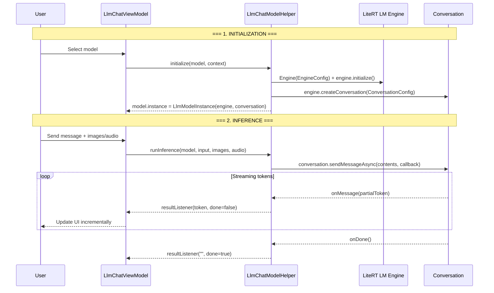
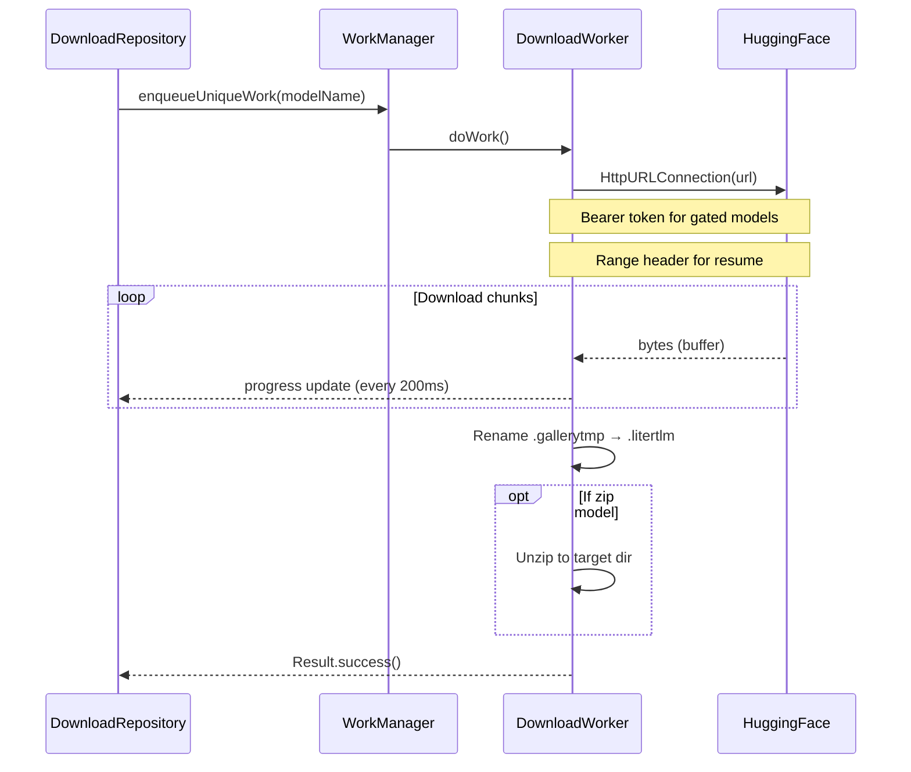
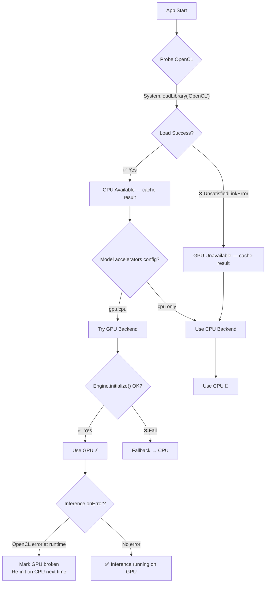

# Google AI Edge Gallery — Backend Inference Architecture

## Overview

The **Google AI Edge Gallery** is an Android app (Kotlin/Jetpack Compose) that runs **on-device LLM inference** using Google's **LiteRT LM SDK** (`com.google.ai.edge.litertlm:litertlm-android:0.9.0-alpha04`). There is **no server-side backend** — all inference runs locally on the phone's GPU/CPU.

---

## Core Inference Engine: LiteRT LM

The entire inference stack is wrapped in a single class:

### [LlmChatModelHelper.kt](file:///d:/Android_App/EdgeMind/gallery-main/Android/src/app/src/main/java/com/google/ai/edge/gallery/ui/llmchat/LlmChatModelHelper.kt)

| Method | Purpose |
|--------|---------|
| `initialize()` | Creates `Engine` + `Conversation` from model file |
| `runInference()` | Sends user message and streams back tokens |
| `cleanUp()` | Closes engine and conversation, frees memory |

---

## Inference Pipeline (End-to-End)



---

## Engine Initialization

```kotlin
val engineConfig = EngineConfig(
    modelPath = modelPath,           // Local .litertlm file path
    backend = preferredBackend,      // Backend.GPU or Backend.CPU
    visionBackend = Backend.GPU,     // For image support (Gemma 3n)
    audioBackend = Backend.CPU,      // For audio support (Gemma 3n)
    maxNumTokens = maxTokens,        // Default: 1024
)
val engine = Engine(engineConfig)
engine.initialize()

val conversation = engine.createConversation(
    ConversationConfig(
        samplerConfig = SamplerConfig(topK, topP, temperature),
        systemInstruction = systemInstruction,
        tools = tools,
    )
)
```

## Running Inference

```kotlin
val contents = mutableListOf<Content>()
for (image in images) contents.add(Content.ImageBytes(image.toPngByteArray()))
for (audioClip in audioClips) contents.add(Content.AudioBytes(audioClip))
if (input.trim().isNotEmpty()) contents.add(Content.Text(input))

conversation.sendMessageAsync(Contents.of(contents), object : MessageCallback {
    override fun onMessage(message: Message) { /* partial token */ }
    override fun onDone() { /* generation complete */ }
    override fun onError(throwable: Throwable) { /* handle error */ }
})
```

---

## All Supported Models (allowlist `1_0_10.json`)

| # | Model | HuggingFace Repo | File | Size | Vision | Audio | Min RAM | Accelerator |
|---|-------|-----------------|------|------|--------|-------|---------|-------------|
| 1 | **Gemma-3n-E2B-it** | `google/gemma-3n-E2B-it-litert-lm` | `gemma-3n-E2B-it-int4.litertlm` | 3.6 GB | ✅ | ✅ | 8 GB | CPU, GPU |
| 2 | **Gemma-3n-E4B-it** | `google/gemma-3n-E4B-it-litert-lm` | `gemma-3n-E4B-it-int4.litertlm` | 4.9 GB | ✅ | ✅ | 12 GB | CPU, GPU |
| 3 | **Gemma3-1B-IT** | `litert-community/Gemma3-1B-IT` | `gemma3-1b-it-int4.litertlm` | 584 MB | ❌ | ❌ | 6 GB | GPU, CPU |
| 4 | **Qwen2.5-1.5B-Instruct** | `litert-community/Qwen2.5-1.5B-Instruct` | `...q8_ekv4096.litertlm` | 1.6 GB | ❌ | ❌ | 6 GB | GPU, CPU |
| 5 | **Phi-4-mini-instruct** | `litert-community/Phi-4-mini-instruct` | `...q8_ekv4096.litertlm` | 3.9 GB | ❌ | ❌ | 6 GB | GPU, CPU |
| 6 | **DeepSeek-R1-Distill-Qwen-1.5B** | `litert-community/DeepSeek-R1-Distill-Qwen-1.5B` | `...q8_ekv4096.litertlm` | 1.8 GB | ❌ | ❌ | 6 GB | GPU, CPU |
| 7 | **TinyGarden-270M** | `google/functiongemma-270m-it` | `tiny_garden.litertlm` | 288 MB | ❌ | ❌ | 6 GB | CPU only |

> Older allowlists used `.task` extension; latest uses `.litertlm`. Same format, just rebranded.

---

## What is the `.litertlm` (`.task`) Format?

These are **pre-converted, pre-quantized model bundles** specifically created for the LiteRT LM runtime:

- **Custom binary format** optimized by Google for on-device inference
- Models are **converted + quantized** (int4/q8) offline using Google's conversion tools
- Contains model weights, tokenizer, and inference graph — **all in one bundled file**
- The LiteRT LM `Engine` loads them directly into GPU/CPU memory
- **NOT** standard GGUF, SafeTensors, or ONNX — you cannot create these from raw HF weights yourself
- Pre-converted files are hosted on HuggingFace under `google/` and `litert-community/` repos

---

## Model Download Mechanism (from HuggingFace)

### URL Construction ([ModelAllowlist.kt](file:///d:/Android_App/EdgeMind/gallery-main/Android/src/app/src/main/java/com/google/ai/edge/gallery/data/ModelAllowlist.kt#L51-L52))

```kotlin
val downloadUrl = "https://huggingface.co/$modelId/resolve/$commitHash/$modelFile?download=true"
```

**Example** for Gemma-3n-E2B:
```
https://huggingface.co/google/gemma-3n-E2B-it-litert-lm/resolve/ba9ca88.../gemma-3n-E2B-it-int4.litertlm?download=true
```

### Download Flow



### Key Features
- **Resume support** — uses HTTP `Range` header for partial downloads
- **Gated model auth** — sends `Authorization: Bearer <token>` (HuggingFace OAuth)
- **Foreground service** — shows notification with progress percentage
- **Storage path**: `{externalFilesDir}/{normalizedName}/{commitHash}/{modelFile}`

---

## Task & Plugin Architecture

### Built-in Tasks

| Task ID | Label | Modalities |
|---------|-------|------------|
| `llm_chat` | AI Chat | Text only |
| `llm_ask_image` | Ask Image | Text + Image |
| `llm_ask_audio` | Audio Scribe | Text + Audio |
| `llm_prompt_lab` | Prompt Lab | Text (single-turn) |
| `llm_tiny_garden` | Tiny Garden | Text (function calling) |
| `llm_mobile_actions` | Mobile Actions | Text (on-device actions) |

### CustomTask Plugin System

Tasks are registered via `CustomTask` interface + **Hilt DI** (`@Provides @IntoSet`):

```kotlin
interface CustomTask {
    val task: Task                    // Metadata
    fun initializeModelFn(...)       // → LlmChatModelHelper.initialize()
    fun cleanUpModelFn(...)          // → LlmChatModelHelper.cleanUp()
    @Composable fun MainScreen(...)  // UI
}
```

### ViewModel Layer

| ViewModel | Purpose |
|-----------|---------|
| `LlmChatViewModel` | Multi-turn chat with streaming |
| `LlmSingleTurnViewModel` | Single prompt → response (Prompt Lab) |
| `BenchmarkViewModel` | Prefill/decode token benchmarking |
| `ModelManagerViewModel` | Download, init, cleanup lifecycle |

---

## Configuration System

| Parameter | Default | Range | Effect |
|-----------|---------|-------|--------|
| **Max Tokens** | 1024 | — | Max output length |
| **TopK** | 64 | 5–100 | Sampling diversity |
| **TopP** | 0.95 | 0.0–1.0 | Nucleus sampling threshold |
| **Temperature** | 1.0 | 0.0–2.0 | Randomness control |
| **Accelerator** | GPU | GPU/CPU | Hardware backend |

---

## Key Dependency

```toml
litertlm = "0.9.0-alpha04"
# com.google.ai.edge.litertlm:litertlm-android
```

This is the **only inference library** — wraps the MediaPipe LLM Inference API and provides `Engine`, `Conversation`, `Content`, and `MessageCallback` abstractions.

---

## Processing Unit Selection Logic

EdgeMind automatically selects the best available hardware for inference. The logic runs in [`LlmChatModelHelper.kt`](file:///D:/Android_App/EdgeMind/app/app/src/main/java/com/edgemind/app/data/LlmChatModelHelper.kt).

### Decision Flow



### Per-Component Backend Assignment

| Component | GPU Device | CPU-Only Device |
|-----------|-----------|-----------------|
| **Model Inference** | GPU (OpenCL) | CPU |
| **Token Sampling** | GPU (TopK OpenCL Sampler) | CPU (TopK CPU Sampler) |
| **Vision Processing** | GPU | Not available (no vision on CPU) |
| **Audio Processing** | CPU | CPU |

### OpenCL Detection Method

```kotlin
// 1. Check if OpenCL .so files exist on device
val paths = listOf(
    "/system/lib64/libOpenCL.so",
    "/vendor/lib64/libOpenCL.so",
    // ... more paths
)

// 2. Actually try to load the library (more reliable than file check)
try {
    System.loadLibrary("OpenCL")
    // GPU is truly available
} catch (e: UnsatisfiedLinkError) {
    // GPU not usable — force CPU
}

// 3. Cache result for entire app session (probe once)
```

### Auto-Recovery During Inference

If GPU passes init but fails during inference (sampler tries OpenCL):
1. `onError` callback catches the `"OpenCL"` error message
2. Marks `gpuProbeResult = false` (cached for session)
3. User sees error: "GPU not supported — re-open model for CPU"
4. Next model init automatically uses CPU

### Device Compatibility

| Device Type | GPU | What EdgeMind Uses |
|-------------|-----|-------------------|
| Pixel 6+ / Samsung S21+ (with Mali/Adreno) | ✅ OpenCL | **GPU** — fast inference |
| Older/budget phones | ❌ No OpenCL | **CPU** — slower but works |
| Emulator (AVD) | ❌ No OpenCL | **CPU** — for testing |
| Qualcomm Snapdragon with HTP NPU | ⚠️ Not yet | CPU/GPU (NPU not supported by LiteRT LM SDK yet) |

> **Note:** NPU (Neural Processing Unit) is not currently supported by the LiteRT LM SDK. When Google adds NPU support, EdgeMind will detect and use it automatically through the same fallback mechanism.

---

## Build Commands

```powershell
# Set Java (Android Studio's bundled JDK)
$env:JAVA_HOME = "C:\Program Files\Android\Android Studio\jbr"

# Debug APK (for testing & sharing)
.\gradlew assembleDebug

# Release APK (for production)
.\gradlew assembleRelease
```

APK output: `app\build\outputs\apk\debug\app-debug.apk`


to build apk in release mode
PS D:\Android_App\EdgeMind\app> $env:JAVA_HOME = "C:\Program Files\Android\Android Studio\jbr"
PS D:\Android_App\EdgeMind\app> & "$env:JAVA_HOME\bin\keytool" -genkey -v -keystore D:\Android_App\EdgeMind\app\edgemind-release.jks -keyalg RSA -keysize 2048 -validity 10000 -alias edgemind -storepass edgemind123 -keypass edgemind123 -dname "CN=EdgeMind"
Generating 2,048 bit RSA key pair and self-signed certificate (SHA384withRSA) with a validity of 10,000 days
        for: CN=EdgeMind
[Storing D:\Android_App\EdgeMind\app\edgemind-release.jks]
PS D:\Android_App\EdgeMind\app> 
PS D:\Android_App\EdgeMind\app> $env:JAVA_HOME = "C:\Program Files\Android\Android Studio\jbr"
PS D:\Android_App\EdgeMind\app> cd D:\Android_App\EdgeMind\app
PS D:\Android_App\EdgeMind\app> .\gradlew assembleRelease
Starting a Gradle Daemon (subsequent builds will be faster)
<======-------> 50% CONFIGURING [12s]
